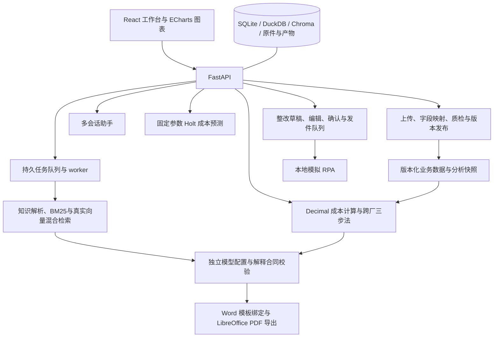

# 药衡智析技术方案

## 系统架构

采用模块化单体：React 工作台、FastAPI 接口、后台任务 worker 和独立本地模拟 RPA。成本计算与模型解释分开，模型不负责重算金额。任务和配置持久化，浏览器刷新不会丢失已保存数据。

源码在 `05_原型/backend/pharma` 和 `05_原型/frontend/src`。SQLite 保存任务、人工登记、助手及模型账本；业务事实经 DuckDB/结构化快照计算；Chroma 保存向量索引。所有运行数据与源码分离，可使用环境变量指定持久目录。

## 数据口径与计算

业务 CSV/XLSX 先上传保留原件，再进行列映射、数值及单位校验、业务粒度去重和累计发布。上传不等于导入成功；冲突不静默覆盖，明确选择版本替换后才发布新组合。金额用 Decimal，产量独立去重；缺失不补零，不将汇总与同粒度明细重复相加。

环比、同比和预算偏差分别保留基期；总成本与单位成本分开展示，季度单位成本按产量加权。贡献度按要素差额与总差额计算。严格超过±10%才触发重点分析，恰好±10%不触发。趋势、瀑布、结构及产品月份热力图共用后端快照，避免页面与报告使用不同口径。

跨厂按“找差异、拆结构、拆原因”输出差异表、要素结构和证据支持的解释。厂际比较说明方向和分母。原题未提供的二厂采购价、单耗或工时保持缺失；价格和耗用不能仅凭单位成本混合差额拆成已证实原因。

## RAG 切分、向量化与检索

PDF按页提取，DOCX按段落和表格提取，TXT按行段定位；标题、文档版本、产品、工厂、期间及规格写入证据元数据。正文按约500字边界切分、80字重叠，短标题和控制信息用于元数据，低质片段拒收。

真实向量模型采用项目支持的 `Xenova/bge-large-zh-v1.5` 量化 ONNX 与配套分词器，CPU 推理、1024维向量。安装清单见 [embedding_manifest.json](embedding_manifest.json)。不使用随机向量；资产须完成真实推理和维数验证。

词法侧使用中文分词和FTS5 BM25，语义侧使用Chroma召回；RRF融合，词法锚定查询采用0.75/0.25，其他查询采用0.5/0.5。召回前约束企业、产品、工厂、期间、规格和文档版本，补充检索仍受同一范围约束。知识图谱补充产品关联药材与工序词，不取消适用范围过滤。

候选索引建完并校验后切换当前版本；部分向量失败不能标为完整混合索引。模型不可用时可降级BM25，接口明确返回降级原因。来源展示保留文档、页码或行段、引用原文和适用条件。

## Prompt 与解释合同

向模型提供结构化快照、可用指标、选定证据和任务范围。输出区分数值事实、文档事实、假设及证据不足：数值绑定既有指标，引用绑定来源与原文，假设说明缺少的采购、生产或计量记录。建议必须包含核查对象、预期证据、责任角色和期限依据。

模型不允许自由编造金额和来源。校验器检查数值绑定、逐字引用、证据适用性、重点要素覆盖和可执行建议；失败最多进行有界修复，仍不满足时保留规则基础分析并标记模型降级。记录请求与响应模型身份、调用预算、用量和缓存来源。真实新增调用与缓存复用分别统计。

分析、提取和助手连接独立配置；模型路由根据任务选择连接，回退状态可查询。Agent先以确定性策略判断是否需要新报告，执行入口再次确认，决策说明可以按配置使用模型。

## Word 模板解析与报告导出

扫描Word XML中的占位符，按段落及书签锚点建立字段语义映射，保留数值单位与百分号含义；原模板只读，工作副本独立。上传模板先检查固定章节和可识别字段，再安装；失败保留上一可用模板。

报告用快照值填入占位符，插入图表、来源与建议；原模板水印按现有实现保留。渲染后重新打开Word核查未替换字段、计算绑定和文件结构，再由LibreOffice导出PDF。月度、季度和专题任务均记录输入、版本和产物校验值。详情见 [模板解析](template_parsing.md) 与 [Prompt设计](prompt_design.md)。

## 模块 API

| 模块 | 主要入口 | 行为 |
|---|---|---|
| 上传与业务解析 | `POST /api/imports/uploads`、`POST /api/data/parse`、`GET /api/workspace` | 原件保留、累计导入、质检与版本替换 |
| 知识库 | `POST /api/kb/build`、`POST /api/kb/search` | 建库、重建、混合检索与来源 |
| 模板 | `POST /api/templates/parse`、`GET /api/templates` | 检查后安装，失败保留 |
| 分析/对标 | `POST /api/analyses`、`GET /api/benchmarks` | 单位/总额、期间比较及三步法 |
| 报告 | `POST /api/reports`、`GET /api/jobs/{id}` | 异步进度、缓存、失败状态、文件下载 |
| 整改 | `POST /api/actions`、`PUT /api/actions/{id}`、`POST /api/actions/{id}/confirm` | 草稿、保留来源的编辑、确认后模拟发送 |
| 助手 | `/api/assistant/conversations`、`/api/assistant/turns/{id}` | 多会话、流转状态及持久化 |
| 扩展 | `/api/forecast`、`/api/kb/graph`、`/api/model/routes`、`/api/agent/decision` | 预测、图谱、路由和Agent |

完整参数与响应以运行服务的 `/docs` 为准。API 不回传私密密钥；上传和来源访问限制路径与上下文。模拟送达、责任人确认、整改完成独立统计；评测中的隔离角色不能当作真实签收。

## 部署、复用与行业扩展

原生入口管理Web/API、worker和本地模拟服务，记录本项目进程身份，重复启动复用已有服务。Compose提供同样三职责，普通用户运行、命名卷持久化、默认仅本机端口开放。容器依赖由镜像提供，模型资产在容器内安装或通过明确挂载接入。

通过 `PHARMA_PYTHON` 复用兼容虚拟环境，Node依赖按锁文件隔离，共享包和浏览器缓存。部署说明见 [环境与部署](环境与部署.md)。

行业包封装术语、数据模式、计量与预算政策、知识范围和模板入口。迁移到其他行业须补齐真实数据合同、行业知识、单位换算及测试金标准；现有合成行业包只证明扩展接口可运行，不代表某行业已完成业务验收。
