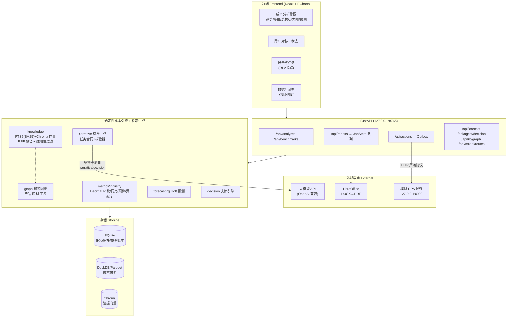
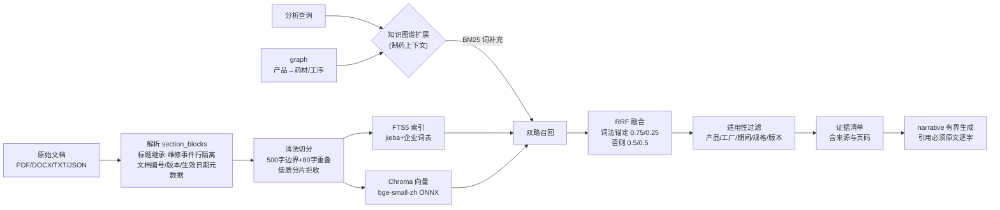
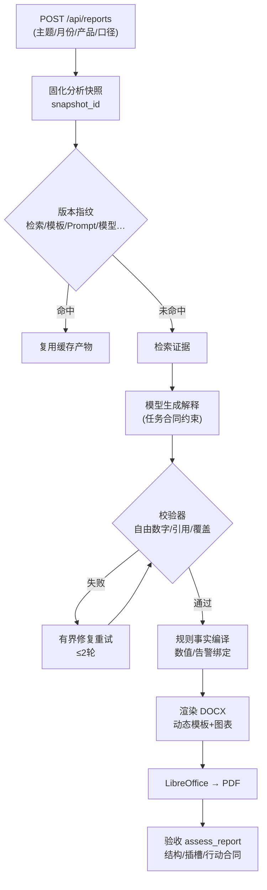
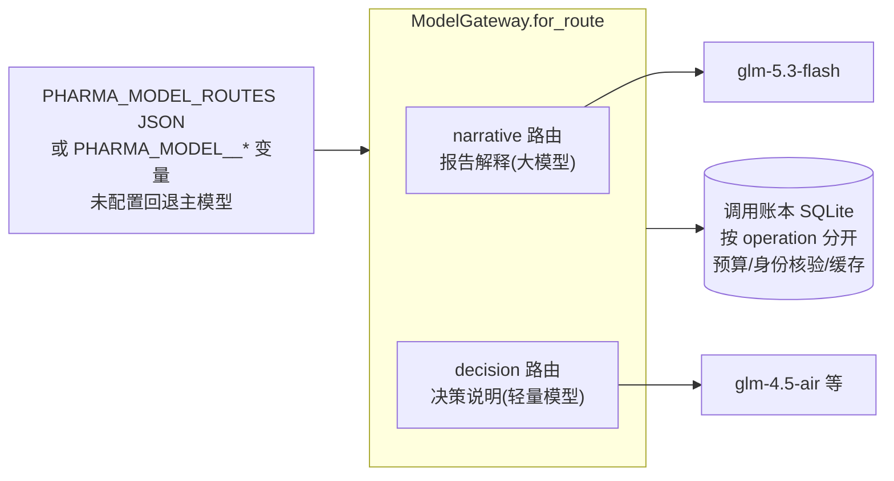
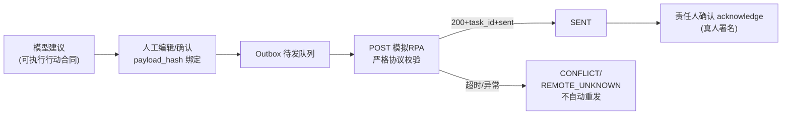

# 系统架构 / System Architecture

> 本文档提供赛题技术方案要求的系统架构图、RAG 流程说明与关键链路图。
> This document provides the system architecture diagram, RAG pipeline and key
> flow diagrams required by the competition technical proposal.

## 1. 系统总体架构 / Overall Architecture

四层单体应用：React+ECharts 前端、FastAPI HTTP 层、确定性成本引擎与检索生成层、SQLite/DuckDB/Chroma 存储层。全部服务绑定 127.0.0.1，报告任务经持久队列由单 worker 串行处理，保证同输入可复现。

**要点 / Key points**
- 前端只消费 API 与静态产物；任何数字都由后端确定性计算，前端不做业务运算。
- 报告生成经 JobStore 入队（缓存键=全链路版本指纹），worker 串行处理并在安全检查点恢复。
- 模型网关按任务路由（见 §4），账本按 operation 分开记录调用与预算。

## 2. RAG 检索增强流程 / RAG Pipeline

**切分策略 / Chunking**：按段落/换行边界切 500 字、保留 80 字重叠；文档控制行（编号/版本/密级）与短标题行只作元数据不进入正文证据。
**向量化 / Embedding**：`Xenova/bge-small-zh-v1.5` 量化 ONNX，CPU 推理，SHA 指纹纳入知识版本。
**检索策略 / Retrieval**：BM25+向量双路，RRF 融合；含具体参数/文档名词的查询按词法锚定加权；行业包可配置 purpose 补充检索（如当期维修事件预留位）。知识图谱把所选产品的药材与工序名补充进 BM25 查询词（仅制药上下文，召回仍受全部适用性合同约束）。
**来源定位 / Provenance**：每条证据携带文件名、页码/段落位置、文档版本与适用范围；引用进入正文前必须逐字匹配。

## 3. 报告生成链路 / Report Pipeline

## 4. 多模型协作路由 / Multi-Model Routing

每次调用记录请求与响应 model 并核验身份（VERIFIED/MISMATCH）；narrative 与 decision 各自独立预算，轻量任务用轻模型降低成本。未配置第二模型时同源回退并在回执中如实标注 `dedicated=false`。

## 5. RPA 整改闭环 / RPA Loop

## 6. 部署视图 / Deployment

- 一键启动：`bash 05_原型/scripts/bootstrap.sh && bash 05_原型/scripts/start.sh`（Windows Git Bash / Linux / WSL 同一入口，解释器与平台差异由 `pharma_python.sh`、`manage.py` 分支处理）。
- 依赖锁定：`requirements.lock`（Windows 自动剔除 POSIX-only 项）+ 前端 `package-lock` 指纹重建。
- 无密钥/无嵌入模型均可降级启动：解释降级（rules 模式）、关键词检索兜底；回执如实标注，不冒充通过。
