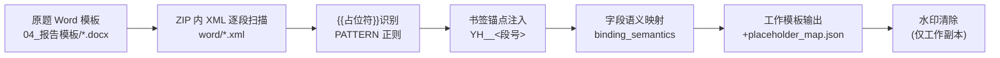

# 报告模板解析逻辑 / Report Template Parsing

> 入口：`pharma/reports.normalize_template`（制药原题模板）。行业包使用包内
> `template_entry` 提供的报告结构（`reference_report.render` 渲染）。

## 1. 解析流程 / Parsing Flow

1. **占位符识别**：扫描 `word/document.xml` 等部件的每个段落（`w:p`），用正则提取 `{{名称}}` 形态的动态占位符；对“人工环比/制造费用环比”类字段按后续是否紧跟 `%` 区分“比例/金额”两个绑定字段。
2. **结构锚点**：含占位符的段落注入唯一书签（`YH_<文件哈希>_<段落号>`），渲染与校验阶段按书签定位回写，避免按文本搜索替换造成的误替换。
3. **语义映射**：`binding_semantics` 为每个字段声明取值来源（快照指标/要素/比较口径）与单位；缺值策略统一为“N/A 并在正文说明缺值原因”，不补零。
4. **特例处理**：模板第 235 段的纯文本 `100%` 是合计贡献度的排版拆分，规范为 `{{合计贡献度}}%` 绑定；该魔法索引与当前赛题模板字节绑定（`original_hash` 校验）。
5. **水印**：仅工作副本移除出题方水印节点，原件不动。
6. **压缩副本**：`compact_working_template` 生成无历史修订的紧凑工作副本，指纹 `template_hash` 进入任务缓存键。

## 2. 五章节结构 / Required Sections

原题模板至少包含：①封面与基本信息 ②总成本概览 ③成本要素明细分析 ④重点产品专项分析 ⑤总结与建议。渲染后 `assess_report` 按占位符映射与残留插槽（`{{`）扫描验证结构完整度；任何未解析插槽都会使验收失败。

## 3. 渲染与校验 / Render & Verify

- `render_docx`：快照指标 → 书签段落回写；数字断行用不换行控制保护；表格/图表嵌入后重新计算目录。
- `verify_docx`：重新打开产物，逐占位符核对绑定值与来源哈希；模板被改写（如插入后损坏）会拒绝。
- PDF：LibreOffice 无头转换，字体嵌入与逐页图由验收脚本核验。
